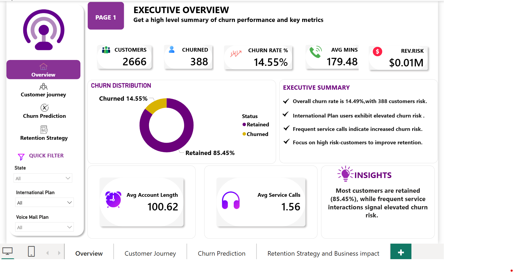
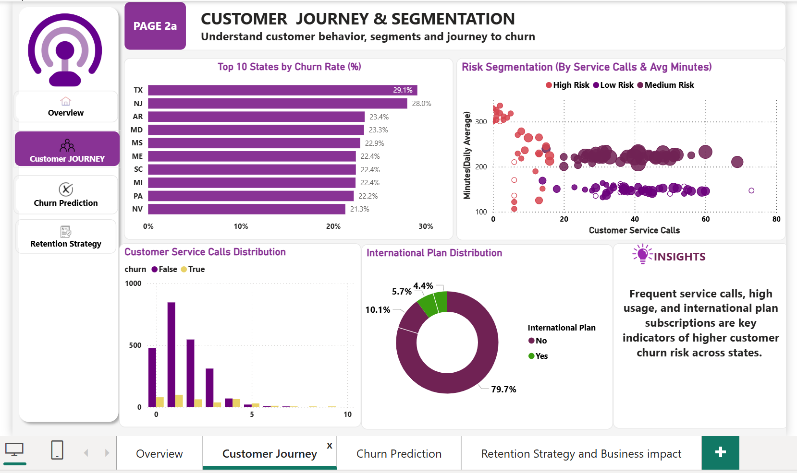
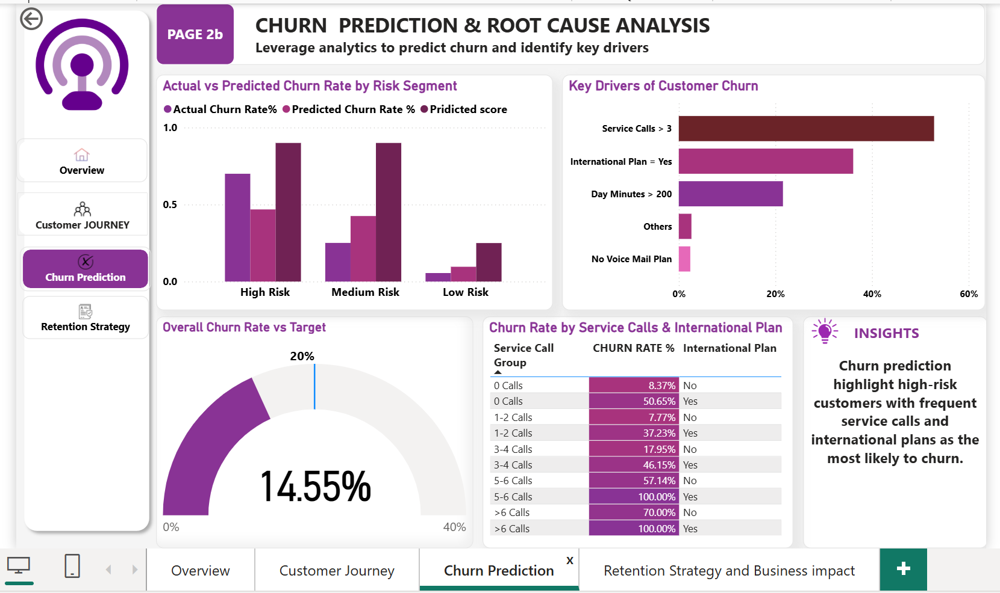
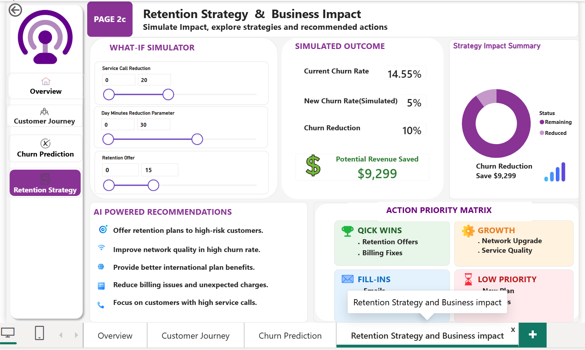

📊 Telecom Customer Churn Analysis

📌 Project Overview

This project analyzes customer churn patterns in a telecom company using SQL, Python, and Power BI. The objective is to identify key factors driving customer attrition and provide actionable recommendations to improve customer retention.

---

🎯 Objectives

- Analyze customer churn behavior.
- Identify factors contributing to churn.
- Predict high-risk customers.
- Develop retention strategies to reduce churn.
- Create an interactive Power BI dashboard for business insights.

---

🛠 Tools & Technologies

- SQL – Data exploration and business insights
- Python – Data cleaning and analysis
- Power BI – Interactive dashboard creation
- CSV Dataset – Telecom customer data

---

📂 Project Structure

telecom_churn_project
│
├── Dashboard
│   └── telecom_churn_dashboard.pbix
│
├── Data
│   └── telecom_churn.csv
│
├── Images
│   ├── 01_overview_dashboard.png
│   ├── 02_customer_journey.png
│   ├── 03_churn_prediction.png
│   └── 04_retention_strategy.png
│
├── Python
│   └── churn_analysis.py
│
├── SQL
│   └── telecom_churn_analysis.sql
│
└── README.md

---

📈 Dashboard Pages

1. Executive Overview

- Customer count and churn rate KPIs
- Churn distribution
- Executive summary and insights

2. Customer Journey Analysis

- Customer behavior analysis
- Service usage patterns
- Churn drivers by segments

3. Churn Prediction

- Risk segmentation
- Actual vs Predicted churn analysis
- High-risk customer identification

4. Retention Strategy & Business Impact

- AI-powered recommendations
- Action Priority Matrix
- Strategy Impact Summary
- Business impact metrics

---

🔍 Key Insights

- Overall churn rate is 14.55%.
- Customers with an International Plan show higher churn risk.
- Frequent service calls are associated with increased churn.
- High-risk customers should be targeted for retention campaigns.

---

💡 Recommendations

- Improve customer support experience.
- Focus on customers with frequent service calls.
- Implement proactive retention strategies.
- Target high-risk customer segments with personalized offers.

---

📸 Dashboard Screenshots

### Executive Overview

### Customer Journey

### Churn Prediction

### Retention Strategy

---

🚀 Author

Konika Chakarborty

Data Analytics | SQL | Python | Power BI